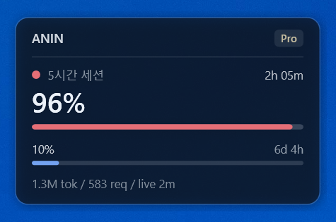
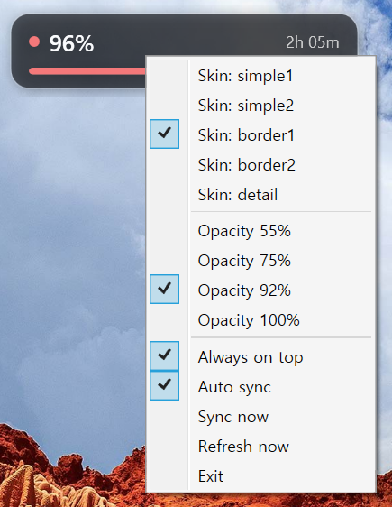
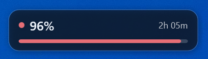
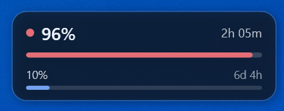

# ClaudMonWidget

[English](README.md) · [한국어](README.ko.md) · [日本語](README.ja.md) · [简体中文](README.zh-CN.md) · **Español**

Un widget de Windows translúcido y siempre visible que muestra tu consumo de
Claude Code.



No hay nada que instalar: funciona con el PowerShell 5.1 y el WPF que vienen con
Windows, y reutiliza las credenciales que Claude Code ya guardó. Sin
`npm install` y sin un inicio de sesión aparte.

## Instalación

Windows 10/11 con Claude Code instalado y con la sesión iniciada: ese es todo el
requisito (o el CLI de OpenAI Codex, para el modo Codex). El widget solo lee
archivos que Claude Code/Codex escriben ellos mismos: hay que haber usado uno
de los dos para que aparezcan números, y el token OAuth necesita que Claude
Code se ejecute de vez en cuando para renovarse.

```powershell
git clone https://github.com/is-an/ClaudMonWidget.git
```

También sirve descomprimir un ZIP donde quieras. El widget escribe
`config.json` y `usage-cache.json` en su propia carpeta, así que debe tener
permiso de escritura (evita `C:\Program Files`). No hay instalador ni nada en el
registro: para quitarlo, borra la carpeta.

## Ejecución

Haz doble clic en **`start-hidden.vbs`**. No aparece ninguna consola. O bien:

```powershell
powershell -NoProfile -ExecutionPolicy Bypass -File widget.ps1 -Skin detail
```

`-ExecutionPolicy Bypass` solo afecta a ese arranque y no cambia la directiva
del sistema.

**Solo se ejecuta un widget a la vez.** Lanzar otro mientras uno está abierto
termina en silencio, así que nunca se apilan con uno viejo encima.

La **carpeta** es portátil: cópiala a donde quieras, incluida una memoria USB, y
la configuración viaja con ella. Los números de consumo siguen viniendo de la
cuenta de Claude Code del equipo donde se ejecute.

## Arranque automático

**Con Windows** — `Win+R` → `shell:startup` y pon ahí un acceso directo a
`start-hidden.vbs`. En Cambiar icono, apunta a `icon.ico` para no quedarte con
el icono de script. Para deshacerlo, borra el acceso directo.

**Con Claude Code** — que arranque con cada sesión:

```powershell
powershell -NoProfile -ExecutionPolicy Bypass -File install-hook.ps1
powershell -NoProfile -ExecutionPolicy Bypass -File install-hook.ps1 -Uninstall
```

Añade una entrada a `hooks.SessionStart` en `~/.claude/settings.json`, deja
intactos tus otros hooks y escribe antes una copia de seguridad con marca de
tiempo. Ejecutarlo dos veces no duplica nada. Ambas rutas guardan una ruta
absoluta, así que vuelve a ejecutarlo tras mover la carpeta.

**El widget sobrevive a Claude Code**: ciérralo con `Exit` en su propio menú.

## Controles

Arrastra para moverlo. Al pasar el ratón aparece un tooltip con el inicio de la
ventana y el desglose de tokens. Menú contextual:

- **Skin** y **Opacity** — una selección cada uno.
- **Always on top**, **Auto sync** — interruptores.
- **Sync now** — consultar a Anthropic ya. **Refresh now** — releer solo los archivos locales.
- **Exit**.



## Skins

Un `1` final muestra solo la sesión de 5 horas; `2` añade la ventana de 7 días.
El predeterminado es `border2`.

| Nombre | Ancho | Muestra |
|---|---|---|
| `simple1` | 150 | Solo el número de 5 horas, sin panel |
| `simple2` | 250 | Dos columnas sin panel: 5 horas y 7 días |
| `border1` | 270 | Píldora redondeada con la barra de 5 horas |
| `border2` | 270 | Píldora redondeada con ambas barras |
| `detail` | 300 | Nombre de cuenta e insignia de plan, ambas barras, tokens y peticiones, origen del dato |

 





`detail` es el de arriba del todo en esta página.

Todas las filas siguen la misma regla: porcentaje a la izquierda, tiempo
restante a la derecha, en unidades acordes a la escala (`3h 04m`, `6d 5h`). La
altura sigue al contenido, así que nada se corta al ampliar la fuente. Colores:
verde por debajo del 70%, ámbar desde el 70%, rojo desde el 90%, gris sin valor.

Añadir un skin es un solo archivo `skins\<nombre>.xaml`; el contrato de
elementos está en PLAN.md.

## De dónde salen los números

Tres orígenes, del más fresco al menos.

**1. Anthropic directamente, cada 5 minutos.**
`GET https://api.anthropic.com/api/oauth/usage` con
`Authorization: Bearer <token>` y `anthropic-beta: oauth-2025-04-20`: el mismo
endpoint que llama Claude Code para dibujar `/usage`, así que los porcentajes
coinciden. El token es el que ya está en
`%USERPROFILE%\.claude\.credentials.json`; el widget nunca te pide iniciar
sesión ni lo envía a ningún otro sitio. La respuesta se guarda en
`usage-cache.json`. **Nunca se escribe en los archivos de Claude Code.**

**2. `%USERPROFILE%\.claude.json` → `cachedUsageUtilization`.**
Los mismos números, pero solo se refrescan cuando Claude Code los pide. Se le vio
44 horas sin actualizar marcando 70% mientras la llamada en vivo devolvía 28%.
Solo como respaldo.

**3. `%USERPROFILE%\.claude\projects\**\*.jsonl`.**
Tokens por petición, releídos cada 5 segundos sin tocar la red. Es nuestro
recuento, no el del servidor. La cifra `tok` son tokens facturados; las lecturas
de caché, 20 veces mayores, solo aparecen en el tooltip.

El nombre de cuenta y la insignia de plan salen del bloque `oauthAccount` de
`~/.claude.json`, leído una vez y sin red.

La última línea de `detail` nombra el origen y su antigüedad — `live now`,
`claude-code 2d`, o un fallo como `token expired` o `http 429`. Un porcentaje
cuyo `resets_at` ya pasó pertenece a una ventana caducada y **no se muestra**:
no presentar nunca un número viejo como si fuera actual es la regla sobre la que
está construido este widget. El sondeo detecta ese cambio de ventana y pide la
nueva de inmediato, así que el hueco dura segundos.

No se muestra el coste en dólares: la línea `cost-state` que lo registra se
escribe cerca del final de una sesión.

## Configuración

`config.json` se crea al cerrar por primera vez; el menú cambia casi todo.

| Clave | Por defecto | Significado |
|---|---|---|
| `skin` | `border2` | Skin inicial; un nombre desconocido vuelve al predeterminado |
| `opacity` | `0.92` | Opacidad de la ventana |
| `left` / `top` | `-1` | Posición; `-1` la coloca abajo a la derecha |
| `pollSeconds` | `5` | Cada cuánto se releen los archivos locales |
| `syncSeconds` | `300` | Cada cuánto se consulta a Anthropic |
| `autoSync` | `true` | Desactivado, solo `Sync now` |
| `windowHours` | `5` | Duración de la ventana de sesión |
| `warnPct` / `dangerPct` | `70` / `90` | Umbrales de ámbar y rojo |

`usage-cache.json` es la última respuesta de sincronización; borrarlo es seguro.

## Resolución de problemas

| Síntoma | Solución |
|---|---|
| No aparece en pantalla | `left` / `top` puede señalar un monitor que ya no tienes. Borra `config.json` |
| Congelado, o un recuento de tokens en vez de un `%` | `Exit` y arranca de nuevo, o pulsa `Sync now` y lee el motivo en la última línea |
| Esa línea dice `token expired` | Ejecuta Claude Code una vez para renovar el token |
| El tiempo restante no coincide con la app | Ambos leen el mismo `resets_at`; busca una versión más nueva. Los segundos se descartan, así que un minuto de diferencia es normal |
| Se bloquea la ejecución de scripts | Todo aquí aplica `-ExecutionPolicy Bypass` por arranque; si persiste, sospecha de una directiva de la organización |

## Desarrollo

```powershell
powershell -NoProfile -ExecutionPolicy Bypass -File test-usage.ps1   # agregación, sin red
powershell -NoProfile -ExecutionPolicy Bypass -File test-menu.ps1    # menú y eventos
powershell -NoProfile -ExecutionPolicy Bypass -File build.ps1        # icon.ico + exe lanzador
```

Las pruebas construyen un árbol `.claude` falso en TEMP con el reloj fijado, así
que no tocan la red y dan el mismo resultado siempre. `icon.ico` está en el
repositorio; el exe no, porque solo lanza `widget.ps1` y `start-hidden.vbs` ya
hace eso sin compilar. PLAN.md recoge las notas de diseño, el contrato de
elementos de los skins y las trampas de PowerShell 5.1 de este proyecto.

## Límites conocidos

- El recuento de tokens es nuestro y puede no coincidir con cómo factura
  Anthropic. El `%` es el número del servidor.
- `/api/oauth/usage` no es una API documentada. Si cambia su forma, la
  sincronización registra `unrecognized response` y conserva la última caché
  válida.
- No hay click-through: dejaría el menú contextual fuera de alcance.
- Solo Windows, atado a WPF.
